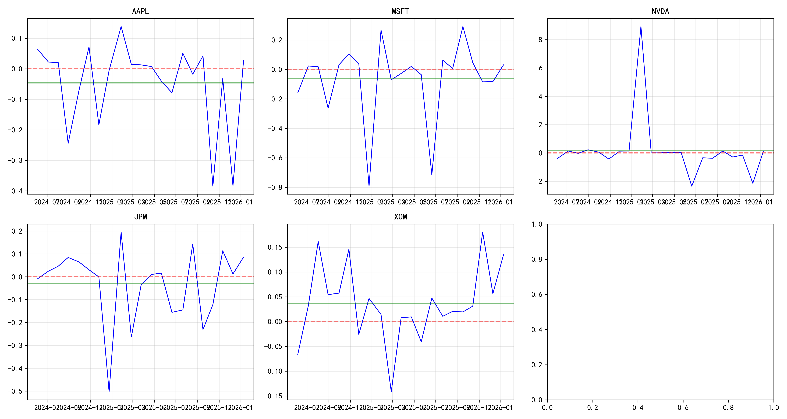

# Behavioral Features and Volatility Prediction: A Stability Analysis

[](https://www.python.org/)
[](https://jupyter.org/)
[](https://opensource.org/licenses/MIT)

---

## 📌 Overview

This project investigates whether behavioral finance features provide **incremental predictive power** for equity volatility beyond simple autoregressive dynamics, with a focus on **predictive stability** across time and stocks.

**Research Question:** After controlling for AR(1) volatility structure, do behavioral features (Overreaction, Herding, Loss Aversion, Disposition) improve out-of-sample volatility forecasts? How stable are these improvements across different stocks and time periods?

---

## 📁 Repository Structure

```
behavioral_finance_project/
│
├── notebooks/
│   ├── 01_single_stock_analysis.ipynb    # Single stock (AAPL) methodology demo
│   └── 02_panel_analysis.ipynb            # Main panel analysis (5 stocks × 3 years)
│
├── output/                                 # All generated outputs
│   ├── data/                              # Cleaned datasets
│   ├── tables/                            # Regression results and statistics
│   └── figures/                            # Visualization outputs
│
├── README.md                               # This file
└── requirements.txt                        # Python dependencies
```

---

## 🔬 Methodology

### Data
- **Stocks**: AAPL, MSFT, NVDA, JPM, XOM (tech, financial, energy sectors)
- **Period**: 3 years daily data (2023-2026)
- **Source**: Alpha Vantage API

### Behavioral Features Constructed

| Feature | Definition |
|---------|------------|
| **Overreaction** | Z-score > 2 extreme days, measured by subsequent 3-day reversal |
| **Herding** | Price-volume direction consistency (rolling 20-day) |
| **Loss Aversion** | Volatility amplification after ≥3 consecutive down days |
| **Disposition Effect** | Volume ratio asymmetry between up/down days |

### Model Specification
- **Baseline**: AR(1) volatility model
- **Full model**: AR(1) + behavioral features
- **Evaluation**: Nested model comparison + Rolling window (250-day window, 20-day step)

---

## 📈 Main Results

### Nested Model Comparison (Out-of-Sample)

| Ticker | AR R² | Full R² | ΔR² | ΔRMSE |
|--------|-------|---------|-----|--------|
| AAPL | 0.964 | 0.968 | +0.004 | 0.07% |
| MSFT | 0.950 | 0.959 | +0.009 | 0.13% |
| NVDA | 0.965 | 0.970 | +0.005* | 0.11%* |
| JPM | 0.964 | 0.965 | +0.001 | 0.11% |
| XOM | 0.958 | 0.960 | +0.002 | 0.07% |

*NVDA results affected by 3 extreme windows (ΔR² = 9.08, -1.66, -1.61)

### Rolling Window Stability

| Ticker | Positive Ratio | CV (ΔRMSE) | Stability Rating |
|--------|----------------|------------|------------------|
| XOM | 76.2% | 1.25 | ⭐⭐⭐ High |
| MSFT | 66.7% | 2.66 | ⭐⭐ Medium |
| JPM | 66.7% | 3.20 | ⭐⭐ Medium |
| AAPL | 57.1% | 4.38 | ⭐⭐ Medium |
| NVDA | 52.4% | 8.47 | ⭐ Low |

### Variable Significance
- **Overreaction**: Significant in 80-100% of windows across all stocks
- **Loss Aversion**: Significant in 4/5 stocks (except XOM)
- **Herding/Disposition**: Stock-specific significance only

---

## 🔍 Sample Visualizations

### Rolling Window Stability


### Stability Summary by Stock


---

## ⚠️ Limitations

- **Sample size**: 5 stocks only, limited sector coverage
- **Model linearity**: No nonlinear effects considered
- **Macro factors**: No controls for market-wide variables
- **Extreme events**: NVDA outliers require further diagnosis

---

## 🔮 Future Work

- Expand to 50+ stocks across more sectors
- Nonlinear models (Random Forest, XGBoost)
- Regularized regression (Ridge/Lasso)
- Conformal prediction for uncertainty quantification
- Macro-economic controls (VIX, interest rates)

---

## 🚀 Quick Start

```bash
# Clone repository
git clone https://github.com/Elena0794/behavioral_finance_project.git
cd behavioral_finance_project

# Install dependencies
pip install -r requirements.txt

# Run notebooks
jupyter notebook notebooks/
```

**Notebooks:**
- `01_single_stock_analysis.ipynb`: Single stock methodology demo
- `02_panel_analysis.ipynb`: Main panel analysis (recommended starting point)

---

## 📚 Citation

```bibtex
@misc{han2026behavioral,
  author = {Elena Han},
  title = {Behavioral Features and Volatility Prediction: A Stability Analysis},
  year = {2026},
  publisher = {GitHub},
  url = {https://github.com/Elena0794/behavioral_finance_project}
}
```

---

## 📬 Contact

For questions or collaboration: [elena.f.han@outlook.com](mailto:elena.f.han@outlook.com)

**Research interests:** Behavioral Finance, Decision Science, Financial Econometrics, Predictive Stability
